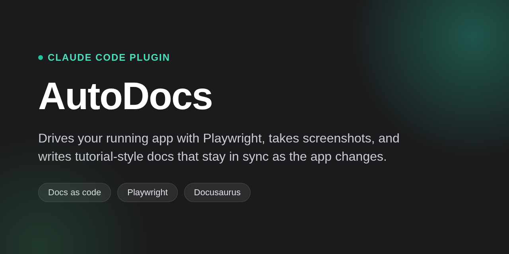

# DocSolace



Claude Code plugin that drives your running web app with Playwright, takes
screenshots, and writes tutorial-style Markdown docs that stay in sync as the
app changes — screenshot-driven, docs-as-code, built for solo developers.

[](./LICENSE)
[](#prerequisites)
[](./plugin/.claude-plugin/plugin.json)
[](https://github.com/esandeepchoudary/docsolace/actions/workflows/test.yml)
[](https://esandeepchoudary.github.io/docsolace/)

DocSolace writes and maintains your app's tutorials for you, by actually
using it. Instead of a human clicking through the app, taking screenshots,
and writing "here's how the dashboard works" — which goes stale the moment
the UI changes — DocSolace drives a real headless browser against your
*running* app, takes the screenshots itself, and writes grounded,
tutorial-style docs from what it actually saw. It's built for **solo
developers**: one person runs it themselves when a feature's worth
documenting, not a team pipeline that fires on every merge.

It ships as a **Claude Code plugin** — that's the primary way to use it, and
what the rest of this README leads with. New to Claude Code? It's
Anthropic's command-line coding agent — see
[the docs](https://docs.claude.com/en/docs/claude-code) if you want the full
picture, but you don't need to have used it before to follow along; the next
section walks through installing it.

## What it does

- **Drives your real app, headlessly** — Playwright clicks through a
  declarative YAML "tour" against your actual running app; no fixtures, no
  hand-authored mockups.
- **Captures screenshots and a11y snapshots together** — every screenshot is
  paired with an accessibility snapshot, which becomes the grounding for the
  prose so nothing gets invented.
- **Skips what hasn't changed** — a drift check compares screenshots and
  source `code_paths` against the last run, so regeneration only touches
  tours that actually changed.
- **Never overwrites your edits** — hand-written content inside
  `<!-- docsolace:keep -->` blocks survives every regeneration untouched.
- **Ships a reviewable PR, never merges** — output lands in `docs/`, staged
  and pushed as a pull request for a human to merge.
- **Publishes as a real docs site** — a bundled [Docusaurus](https://docusaurus.io/)
  scaffold serves `docs/` directly, with built-in search.

## Contents

- [Quickstart](#quickstart)
- [Prerequisites](#prerequisites)
- [Install the plugin](#install-the-plugin)
- [Use it in your project](#use-it-in-your-project)
- [How it works](#how-it-works)
- [Configuring tours and auth](./CONFIGURATION.md)
- [Publishing a docs site](./PUBLISHING.md)
- [Troubleshooting](./TROUBLESHOOTING.md)
- [Advanced topics](./ADVANCED.md) — uploads, forms, async waits, CAPTCHA,
  non-password logins, third-party integrations, seed data, voice input,
  mapping a whole app automatically, running without Claude Code, CI
- [Contributing](./CONTRIBUTING.md) — project layout, status, developing on
  the plugin itself

## Quickstart

Inside Claude Code:

```
/plugin marketplace add esandeepchoudary/docsolace
/plugin install docsolace@docsolace-marketplace
/reload-plugins
```

Then, in the project you want tutorials for:

```
/docsolace:document
```

The first run bootstraps the project — asks for your app's local base URL,
writes a starter `docsolace.config.yaml`, creates an empty `tours/`. Once
you've built something worth documenting:

```
/docsolace:document propose <slug> "<description>"
```

drafts a tour by actually driving your app, then — by default — carries it
all the way through to an opened docs PR. That's the whole loop.

See ["Contents"](#contents) above for reference material on everything else:
every mode `/docsolace:document` supports, configuring auth, edge cases
(uploads, async content, non-password logins, voice input), mapping a whole
app at once, and publishing a docs site. If `/plugin` doesn't behave as
expected, jump to ["Troubleshooting"](./TROUBLESHOOTING.md).

## Prerequisites

- **Claude Code** — install/log in per [its docs](https://docs.claude.com/en/docs/claude-code)
  if you haven't already. Would rather skip it entirely? The underlying
  pipeline is plain Node scripts you can run from a terminal instead — see
  ["Running it without Claude Code"](./ADVANCED.md#running-it-without-claude-code) under "Advanced topics".
- **Node.js 22+** and npm (built and tested against Node 22.21.1; nothing
  here relies on anything newer). Once the plugin is installed, it installs
  its *own* runtime dependencies (Playwright, js-yaml, etc.) into its own
  data directory on first use — never into your project's `node_modules`.
- **git**.

## Install the plugin

This repo doubles as a private Claude Code plugin marketplace with one
plugin in it (`docsolace`). You don't need to clone it into the project you
want to document — just point Claude Code at it once, from anywhere.

Inside Claude Code:

```
/plugin marketplace add esandeepchoudary/docsolace
```

(GitHub shorthand — works as long as you can reach this repo. Working from a
local clone instead? Use the path: `/plugin marketplace add /path/to/docsolace`.)

Then install the plugin from that marketplace:

```
/plugin install docsolace@docsolace-marketplace
```

Activate it in your current session:

```
/reload-plugins
```

(or just restart Claude Code). The first time a session starts with the
plugin active, a `SessionStart` hook installs the plugin's own runtime
dependencies (Playwright, js-yaml, etc.) and the Playwright browser into a
private data directory — this can take a minute the first time (browser
download), and is instant on every session after.

Verify it took:

```
/plugin list
```

should show `docsolace@docsolace-marketplace` enabled.

## Use it in your project

Open Claude Code in whatever project you want tutorials for and run
`/docsolace:document` — plugin skills are namespaced by the plugin's name, so
this is the full command (plain `/document` may also resolve if it's
unambiguous, but `/docsolace:document` always works). **The first time**, it
notices there's no `docsolace.config.yaml` yet, asks for your app's local base
URL, and bootstraps the project: a real, annotated `docsolace.config.yaml`
(every optional section — `auth`, `defaultMask`, `seeds`, etc. — included as
commented-out examples right in the file), an empty `tours/` directory with
a short "what's next" `tours/README.md`, a `.env.example`, and — worth
calling out since it's easy to get wrong by hand — your project's
`.gitignore` gets `.docsolace/artifacts/` and `.env` added automatically, so
the session cookies and credentials those can hold never end up committed.
Then it tells you there's nothing to generate until a tour exists. From
there:

| Command | What it does |
|---|---|
| `/docsolace:document` | Run the full pipeline over every tour, ship a docs PR |
| `/docsolace:document <tour-id>` | Same, but just that one tour |
| `/docsolace:document propose <slug> "<description>"` | Draft a new tour for a feature you just built (via the `tour-scout` subagent), then ship it |
| `/docsolace:document map` | Discover every feature automatically (authenticated crawl + code review), draft and ship a tour for every gap, and archive any existing tour whose feature looks removed |
| `/docsolace:document prune` | Just the archival check above, on its own — no crawl required for the common case |
| `/docsolace:document product` | (Re)generate the product-level pages — overview/getting-started/concepts plus configuration/troubleshooting/changelog/decisions where grounded (via the `product-scribe` subagent), then ship |
| `/docsolace:document validate` | Preflight-check config/tours/product pages, no browser — rarely needed by hand, mostly for CI |
| `/docsolace:document status` | Report which tours/product pages are dirty, clean, or gated, and when each was last generated — read-only, no browser |
| `/docsolace:document init-site` | Scaffold a Docusaurus site for `docs/` (re-running it on an existing site re-applies styling instead of refusing) |

Every mode above except `validate` and `status` (both read-only reports, no
browser, no PR) runs autonomously by default: draft or capture → generate →
open a docs PR, without stopping for review at each step — that PR (never
auto-merged) is the review point. A short list of hard
stops still halts a run and asks rather than pushing through: `tour-scout`
couldn't ground the feature, a voice/microphone flow (always reported
`unverified`), a `validate` error, an auth session that needs a real human at
a headed browser, or a hand-edited docs page outside its keep-region. Append
`--review` to any mode above to fall back to the original stop-and-ask-at-
every-step behavior instead; append `--no-style` to skip design-skill
detection for that run. See `tours/dashboard-export.yaml` in *this* repo for
a worked `propose` example, start to finish (this repo also happens to be
its own best demo project — it's both the plugin source and a working
DocSolace project), and
["Mapping a whole app automatically"](./ADVANCED.md#mapping-a-whole-app-automatically)
in "Advanced topics" for how `map` actually works. Playwright MCP (bundled in the
plugin) is for `tour-scout`'s interactive authoring only; the automated
pipeline (capture/drift/generate/crawl) drives Playwright directly and never
goes through MCP.

### It ships a docs PR for you

Once a run has something to commit, it opens (or updates) a PR itself: it
runs `verify-docs` first — every image reference and internal link/anchor
under the *whole* `docs/` tree has to resolve, not just this run's own pages,
since a rename or archive can break a link on a page the run never touched —
and stops instead of pushing if anything's actually broken. Then it runs
`review-diffs` and folds that report into the commit/PR body (the only place
a screenshot change is visible before it's pushed), stages just `docs/` and
`tours/*.yaml`, and commits **onto whatever branch you're already on** if
it's a `feat/*` or `fix/*` branch — docs land in the same PR as the feature
they document. From `main`/`master` it creates a fresh `docs/<slug>` branch
instead; it never commits generated docs straight to `main`. It never merges
anything — opening or updating the PR is the end of its job.

### It nudges you when a feature looks worth documenting

A second `SessionStart` hook gives Claude standing instructions for every
session in a project where the plugin is installed. Before
`docsolace.config.yaml` exists, that's just a one-line reminder that
`/docsolace:document` will bootstrap things. Once the project is set up, it's
a bit more: whenever Claude finishes a user-facing feature or flow, it's
instructed to ask you whether it's worth a tutorial — suggesting
`/docsolace:document propose <slug> "<description>"` for something new, or
`/docsolace:document <tour-id>` to resync a flow an existing confirmed tour
already covers. Running the suggested command is still your call — but once
you run it, it no longer stops to wait on you at every step: it carries the
draft through to an opened PR by default (see "It ships a docs PR for you"
above), unless it hits one of that section's hard stops. See
`plugin/scripts/lib/session-guidance.mjs` for the exact wording.

### It also documents the product itself

Tours describe individual UI flows; a separate, smaller set of pages
describes the product as a whole so a fresh reader lands somewhere that
actually explains what they're looking at instead of an alphabetical list of
tutorials. `/docsolace:document product` (re)generates up to seven pages —
`docs/overview.md`, `docs/getting-started.md`, `docs/concepts.md`,
`docs/configuration.md`, `docs/troubleshooting.md`, `docs/changelog.md`,
`docs/decisions.md` — via
the `product-scribe` subagent, grounded strictly in files already in your
repo: `README.md`, `package.json`, `.env.example`, `docsolace.config.yaml`,
`CHANGELOG.md` (if present), any `docs/adr/*.md` files, any extra globs you
list under
`product.sources`, and the confirmed tour inventory (id/title/intent) — never
the running app, and never `.env`, key/credential files, or anything under a
`.auth/` directory, even if a glob would otherwise match them. If a page has
nothing real to ground it in (e.g. no `README.md` at all, no troubleshooting
section, no changelog, no `docs/adr/` directory), it's skipped and reported
rather than padded with
invented content — the last four pages are exactly this by default on a
project that doesn't have their grounding, no config needed to turn them
off. With no `CHANGELOG.md`, the changelog page falls back to your repo's own
git tags (newest first) as a bare version history instead of being skipped.
`decisions` is narrower still: it only ever surfaces a decision a human
actually wrote down in a `docs/adr/*.md` file (the well-known "Architecture
Decision Record" convention) — `product-scribe` never infers or guesses
*why* something was built a certain way, even when the reasoning seems
obvious from the code.

This isn't a separate chore — the normal no-argument `/docsolace:document` run
regenerates these pages too, on the same drift-gated pass it already runs for
tours (see "How it works" below), so `/document product` is mainly for
regenerating them on their own without touching any tour. See
["Configuring tours and auth"](./CONFIGURATION.md) for `product.pages`/`product.sources`, and
`docs.sections` for grouping tours in the generated sidebar.

## How it works

Four stages, run in order — this is what `/docsolace:document` orchestrates
end to end (the same stages are also runnable directly as `npm run`
scripts; see
["Running it without Claude Code"](./ADVANCED.md#running-it-without-claude-code) under "Advanced topics"):

1. **Capture** (`npm run capture`) — a **tour** is a YAML file describing one
   feature walk: which pages to visit, what to click, and where to take
   screenshots. DocSolace reads a tour and actually drives a headless browser
   through it against your running app — no fixtures, no mocked-up
   walkthrough, the real thing. Every screenshot is taken at every viewport
   size you've configured (desktop + mobile by default), and every
   screenshot comes with an accessibility snapshot of the page at that
   moment — a structured description of what's really on screen, which
   becomes the "ground truth" for step 3.
2. **Drift check** (`npm run drift`) — comparing this capture against the
   last one, has anything actually changed? If a tour's screenshots and
   underlying source code are both unchanged, there's nothing to
   regenerate — skip it. This is what keeps the pipeline cheap: the
   expensive step (3) only runs for tours that actually changed.
3. **Generate** (`npm run generate-docs`) — for anything the drift check
   flagged, write the tutorial prose. This step is **grounded**: it
   describes only what's actually in the accessibility snapshot from step 1,
   never anything invented or guessed, however plausible-sounding. Any text
   you hand-write inside a page's `<!-- docsolace:keep --> ... <!-- /docsolace:keep -->`
   block (a **keep-region**) is preserved untouched across every future
   regeneration — it's yours, not the tool's.
4. **Publish** — the generated Markdown lives in `docs/`, viewable as-is or
   served through the bundled Docusaurus site (see
   ["Publishing a docs site"](./PUBLISHING.md)).

Alongside tours, the same capture → drift → generate shape maintains the
product-level pages — overview/getting-started/concepts plus configuration/
troubleshooting/changelog/decisions where grounded (see "It also documents
the product itself" above) — except step 1 (capture) doesn't apply
to them at all: there's no browser involved, their "ground truth" is the
repo's own README/package.json/config/tour inventory instead of an
accessibility snapshot.

## Where to go next

Everything above is enough to get a first tour shipped. For more:

- **[CONFIGURATION.md](./CONFIGURATION.md)** — `docsolace.config.yaml`,
  `tours/*.yaml`, page layout and design-skill styling, product pages and
  sidebar sections.
- **[PUBLISHING.md](./PUBLISHING.md)** — building and deploying the bundled
  Docusaurus site (GitHub Pages, Netlify/Vercel).
- **[TROUBLESHOOTING.md](./TROUBLESHOOTING.md)** — common issues, and
  keeping the plugin updated.
- **[ADVANCED.md](./ADVANCED.md)** — uploads, forms, async waits, CAPTCHA,
  non-password logins, third-party integrations, seed data, voice input,
  mapping a whole app automatically, running without Claude Code, CI.
- **[CONTRIBUTING.md](./CONTRIBUTING.md)** — project layout, project status,
  developing on the plugin itself, and pointers to `CLAUDE.md`/the
  implementation brief for going deeper.

## License

[ISC](LICENSE)
