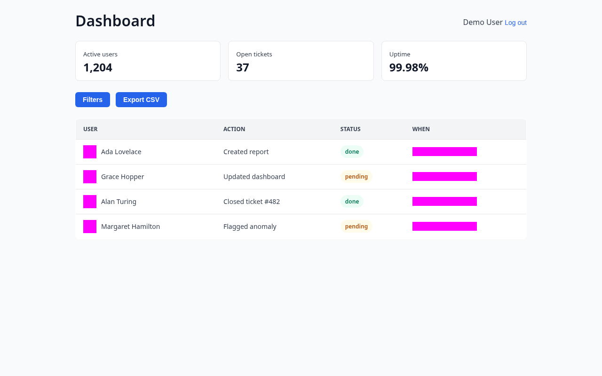
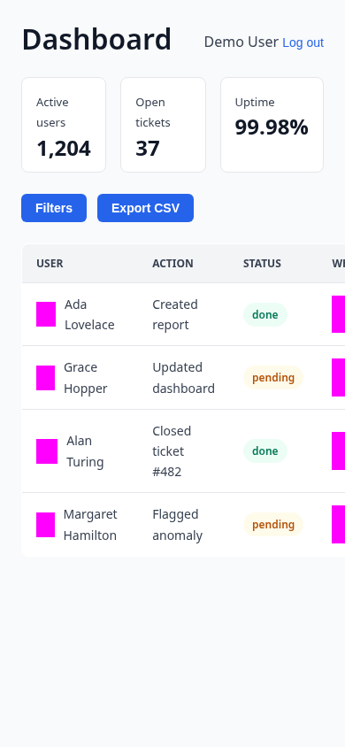
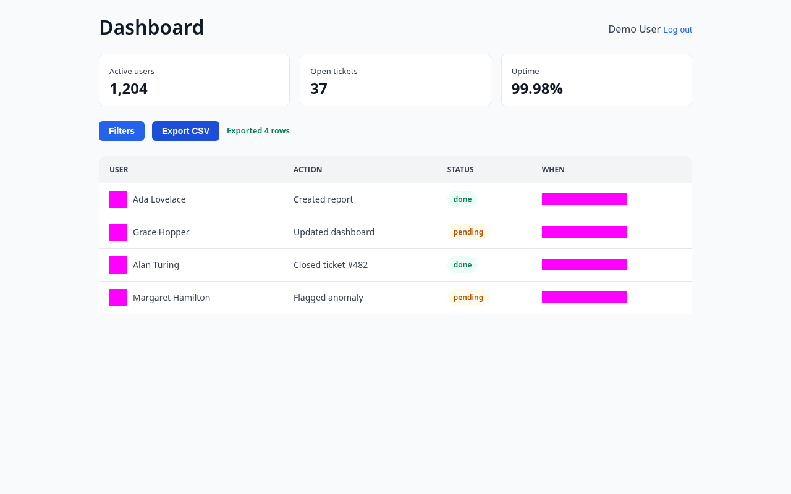
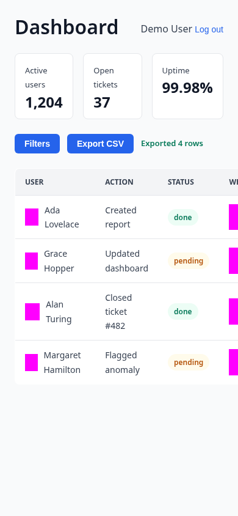

# Export dashboard activity

Show how to export the current activity table as a CSV.

## Steps

1. **Export CSV button visible on the dashboard**

   

   

   
Mobile view

   

   

   Next to the Filters button is an Export CSV button, which starts a client-side export of whatever rows the activity table currently shows.

2. **Confirmation message after exporting**

   

   

   
Mobile view

   

   

   After clicking Export CSV, a confirmation message appears next to the buttons showing how many rows were exported — matching the row count currently visible in the table below.

<!-- docsolace:keep -->
<!-- Notes added here are preserved across regeneration. -->
<!-- /docsolace:keep -->
