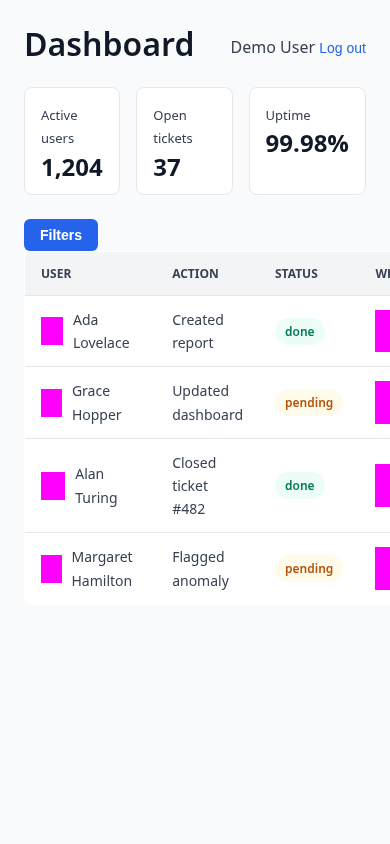
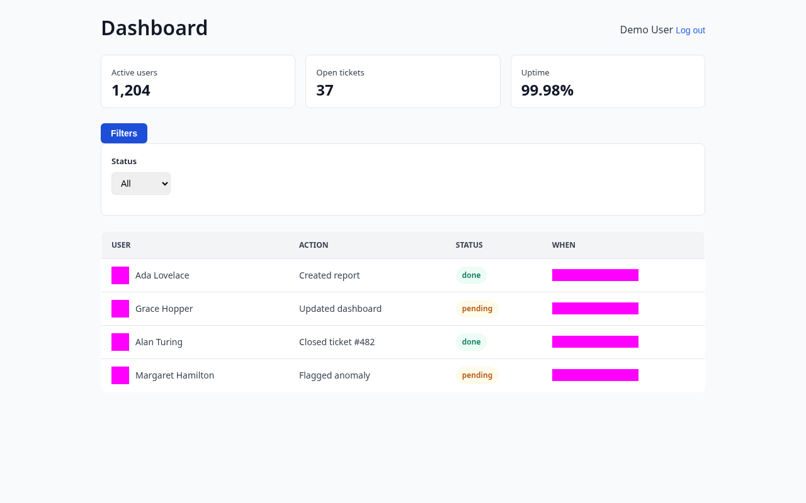
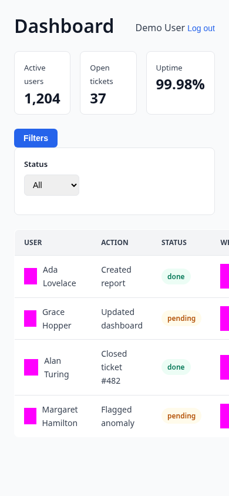

# Dashboard overview

Show a new user what the main dashboard displays and how to read it.

## Steps

1. **Full dashboard after login**

   

   

   
Mobile view

   

   

   After signing in, the dashboard opens with three key-metric cards — active users, open tickets, and uptime — followed by a "Filters" button and a table of recent activity, where each row shows who acted, what they did, and its status.

2. **Filter panel expanded**

   

   

   
Mobile view

   

   

   Clicking "Filters" expands a panel with a Status dropdown (All, Done, Pending) above the activity table, letting you narrow the table to a single status.

<!-- docsolace:keep -->
<!-- Notes added here are preserved across regeneration. -->
<!-- /docsolace:keep -->
