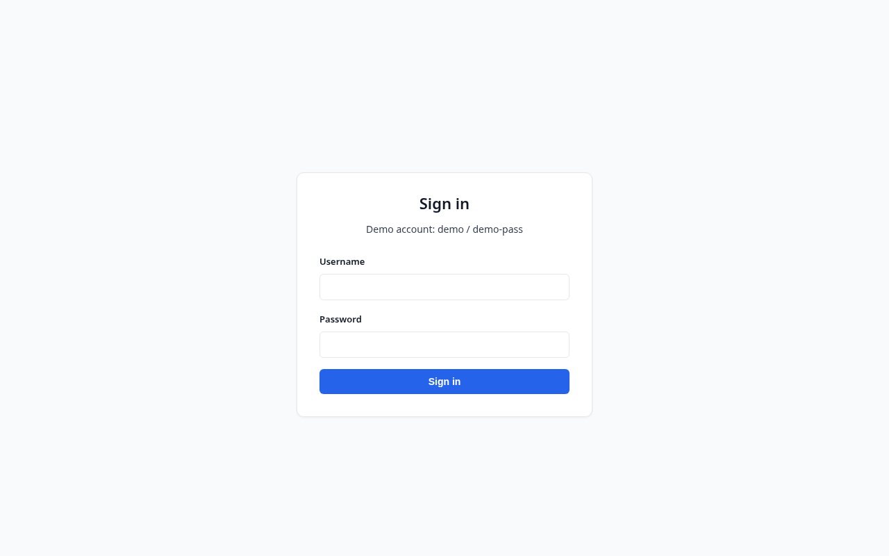
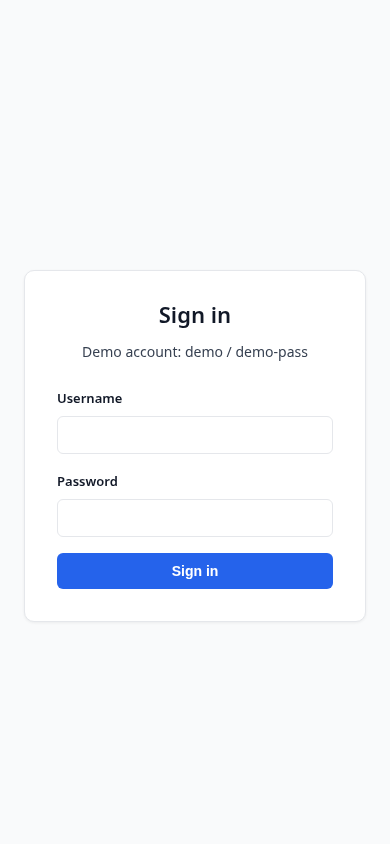

# Login page

Show what a signed-out user sees before authenticating.

## Steps

1. **Login form, signed out**

   

   

   
Mobile view

   

   

   The sign-in form is the first thing a signed-out visitor sees. It asks for a username and password and has a single primary action, the "Sign in" button.

<!-- autodocs:keep -->
<!-- Notes added here are preserved across regeneration. -->
<!-- /autodocs:keep -->
